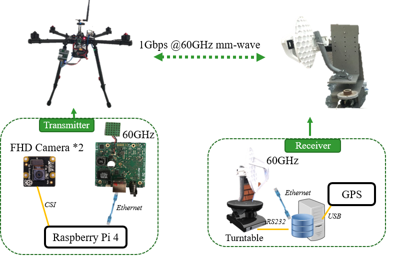
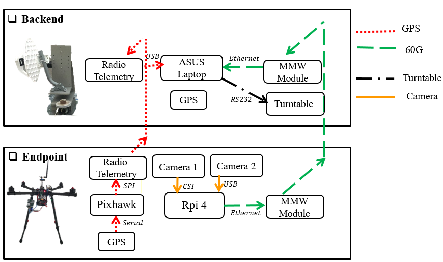
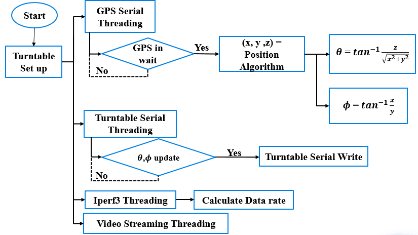
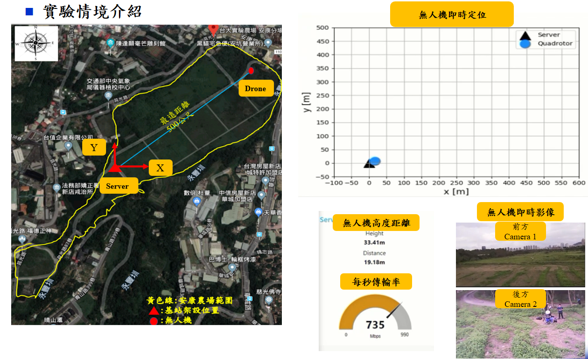
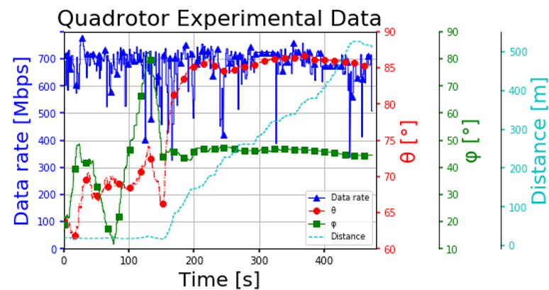

# Test Platform for Real-Time 8K Video Streaming on UAV
## 射月計畫-無人載具4k/8k即時影像傳輸-子計畫四-平台驗證
### Hardware Setup

### System Block Diagram

### System Flow Chart

### Outdoor Experiment Demo @ NTU安康農場

### Outdoor Experiment Result

### 結論

1.透過GPS定位及自動轉台達到全方位即時影像傳輸。
2.已達到多個FHD 相機即時影像傳輸，後續可在基站上做影像拼接，達成4K/8K即時影像傳輸。
